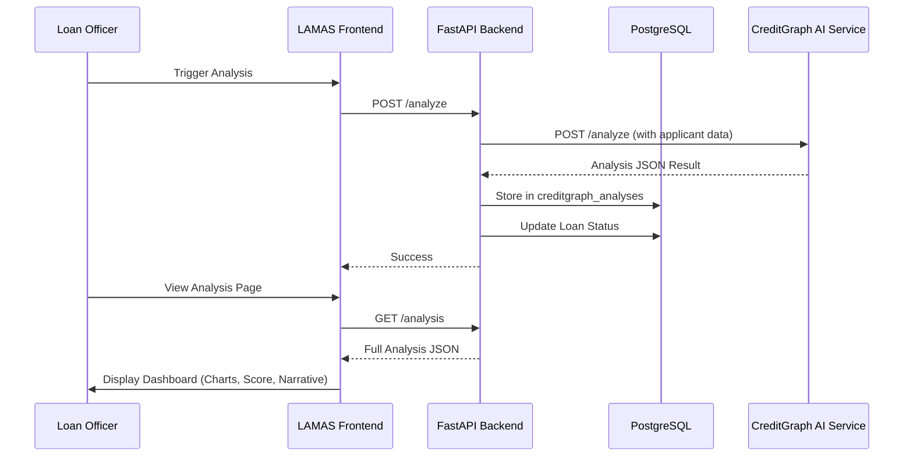

# Phase 8: CreditGraph AI Integration

## Overview

Phase 8 integrates **CreditGraph AI**, a stateless headless credit risk engine, into the LAMaS ecosystem. This integration provides automated risk assessment, multi-dimensional scoring (IRS), and an interactive dashboard for loan officers to make informed decisions.

## Architecture



## Backend Implementation

### Data Layer

- **`CreditGraphAnalysis` Table**: Stores the core risk metrics and the full JSON payload for auditing.
- **One-to-One Relationship**: Each `LoanApplication` is linked to exactly one `CreditGraphAnalysis`.
- **Status Workflow**: Applications can be automatically transitioned to `auto_approved` or `auto_rejected` based on AI output.

### Service Layer

- **`CreditGraphClient`**: A resilient HTTP client with timeouts and error handling.
- **`CreditGraphService`**: Orchestrates data collection (Application + Customer + Documents) and persistence of the results.

### API Endpoints

- `POST /api/v1/creditgraph/loan-applications/{id}/analyze`: Triggers synchronous evaluation.
- `GET /api/v1/creditgraph/loan-applications/{id}/analysis`: Retrieves stored analysis data.
- `GET /api/v1/creditgraph/health`: Health status proxy for the AI engine.

## Frontend Implementation

### Type Safety

Implemented the `CreditGraphFullResponse` interface to strictly type the complex metadata returned by the AI engine:

```typescript
export interface CreditGraphFullResponse {
  irs_breakdown?: {
    irs1: number;
    irs2: number;
    irs3: number;
    irs4: number;
    irs5: number;
  };
  financial_analysis?: {
    detected_income: number;
    reported_income: number;
    discrepancy_ratio: number;
    flags: string[];
  };
  narrative?: string;
  [key: string]: unknown;
}
```

### UI Components

- **DecisionSummaryCard**: High-level verdict, visibility into Case ID, and Risk Category.
- **IRSBreakdownChart**: Dynamic Radar Chart (Recharts) showing Financial Health, Payment Behavior, Digital Footprint, Socio-Demographic, and Stability Signals.
- **FinancialFindings**: side-by-side comparison of Reported vs. Detected income.
- **ReasoningNarrative**: AI-generated justification for the decision.

### Dashboard Workspace

A dedicated route at `/loans/[id]/analysis` provides the full context of the AI evaluation, allowing loan officers to refresh data or trigger re-analysis if necessary.

## Verification

- **Integration Tests**: 29 backend tests ensuring service reliability and data persistence.
- **Frontend Validation**: ESLint strict mode compliance and TypeScript 5.9 compatibility.
- **Real-World Simulation**: Verified processing times and responsive visualization performance.
