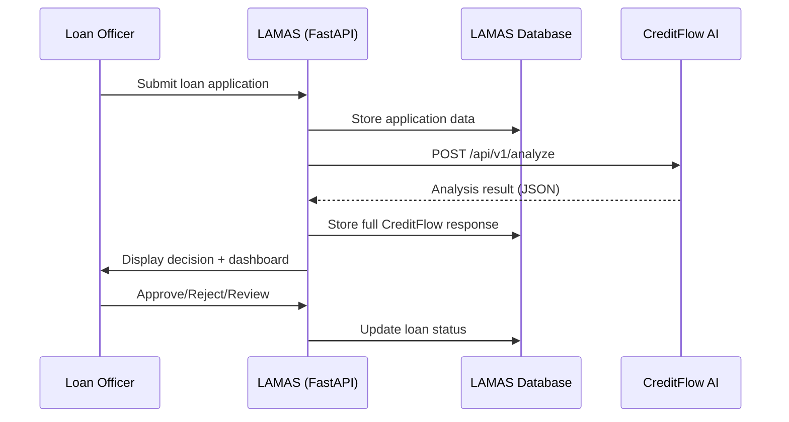

# LAMAS Integration with CreditFlow AI - Requirements

## Overview

This document outlines the **LAMAS-side** requirements for integrating with CreditFlow AI. CreditFlow is a stateless headless backend service that provides credit risk analysis via API. LAMAS is responsible for:

1. Triggering CreditFlow analysis
2. Storing the full analysis response
3. Displaying results to analysts
4. Managing decision workflow (approval, rejection, manual review)

**LAMAS Tech Stack:**

- **Primary:** Python (FastAPI) backend + Next.js frontend
- **Secondary:** Laravel (PHP) version (adapt from Python implementation)

---

## Architecture Overview



---

## Part 1: Backend Integration (FastAPI)

### 1.1 Database Schema

**New Table: `creditflow_analyses`**

Store the full CreditFlow response for audit trail and dashboard display.

```python
# lamas-py/app/models/creditflow.py
from sqlalchemy import Column, Integer, String, Float, JSON, DateTime, ForeignKey, Text
from sqlalchemy.orm import relationship
from datetime import datetime

class CreditFlowAnalysis(Base):
    __tablename__ = "creditflow_analyses"

    id = Column(Integer, primary_key=True, index=True)
    loan_application_id = Column(Integer, ForeignKey("loan_applications.id"), nullable=False, unique=True)

    # CreditFlow response fields
    case_id = Column(String(50), nullable=False, unique=True, index=True)
    decision = Column(String(50), nullable=False)  # APPROVED, REJECTED, MANUAL_REVIEW, APPROVED_PENDING_REVIEW
    irs_score = Column(Integer, nullable=False)
    confidence = Column(Float, nullable=False)
    risk_level = Column(String(20), nullable=False)  # LOW, MEDIUM, HIGH, CRITICAL

    suggested_amount = Column(Float, nullable=True)
    suggested_term = Column(Integer, nullable=True)

    # Full response for dashboard
    full_response = Column(JSON, nullable=False)  # Store entire JSON response

    # Metadata
    analyzed_at = Column(DateTime, default=datetime.utcnow, nullable=False)
    processing_time_ms = Column(Integer, nullable=True)  # Track API response time

    # Relationships
    loan_application = relationship("LoanApplication", back_populates="creditflow_analysis")

    # Indexes
    __table_args__ = (
        Index('idx_decision', 'decision'),
        Index('idx_risk_level', 'risk_level'),
        Index('idx_analyzed_at', 'analyzed_at'),
    )
```

**Update Existing Table: `loan_applications`**

```python
# lamas-py/app/models/loan_application.py
from sqlalchemy.orm import relationship

class LoanApplication(Base):
    # ... existing fields ...

    # Add relationship
    creditflow_analysis = relationship(
        "CreditFlowAnalysis",
        back_populates="loan_application",
        uselist=False  # One-to-one
    )
```

---

### 1.2 CreditFlow API Client

**Service Layer: `creditflow_client.py`**

```python
# lamas-py/app/services/creditflow_client.py
import httpx
from typing import Optional
from datetime import datetime
from app.core.config import settings

class CreditFlowClient:
    """Client for CreditFlow AI API."""

    def __init__(self):
        self.base_url = settings.CREDITFLOW_API_URL  # e.g., https://creditflow-api.example.com
        self.api_key = settings.CREDITFLOW_API_KEY
        self.timeout = 60.0  # 60 seconds for full analysis

    async def analyze_loan_application(
        self,
        applicant: dict,
        loan: dict,
        documents: list[dict],
        config: Optional[dict] = None
    ) -> dict:
        """
        Send loan application to CreditFlow for analysis.

        Args:
            applicant: Applicant personal data
            loan: Loan details
            documents: List of document metadata (URLs to files in LAMAS storage)
            config: Optional config (e.g., skip_osint, narrative_language)

        Returns:
            Full CreditFlow response as dict

        Raises:
            httpx.HTTPError: If API call fails
        """
        payload = {
            "applicant": applicant,
            "loan": loan,
            "documents": documents,
            "config": config or {}
        }

        async with httpx.AsyncClient(timeout=self.timeout) as client:
            response = await client.post(
                f"{self.base_url}/api/v1/analyze",
                json=payload,
                headers={
                    "Authorization": f"Bearer {self.api_key}",
                    "Content-Type": "application/json"
                }
            )
            response.raise_for_status()
            return response.json()

    async def health_check(self) -> bool:
        """Check if CreditFlow API is healthy."""
        try:
            async with httpx.AsyncClient(timeout=5.0) as client:
                response = await client.get(f"{self.base_url}/health")
                return response.status_code == 200
        except Exception:
            return False
```

---

### 1.3 Integration Endpoint

**API Route: `/api/v1/loans/{loan_id}/analyze`**

```python
# lamas-py/app/api/v1/endpoints/loans.py
from fastapi import APIRouter, Depends, HTTPException, BackgroundTasks
from sqlalchemy.orm import Session
from app.db.session import get_db
from app.services.creditflow_client import CreditFlowClient
from app.models.loan_application import LoanApplication
from app.models.creditflow import CreditFlowAnalysis
from app.schemas.creditflow import CreditFlowAnalysisResponse
from datetime import datetime

router = APIRouter()

@router.post("/{loan_id}/analyze", response_model=CreditFlowAnalysisResponse)
async def analyze_loan_with_creditflow(
    loan_id: int,
    background_tasks: BackgroundTasks,
    db: Session = Depends(get_db),
    current_user = Depends(get_current_user)  # Your auth dependency
):
    """
    Trigger CreditFlow AI analysis for a loan application.

    Process:
    1. Retrieve loan application from database
    2. Check if analysis already exists (avoid duplicate calls)
    3. Prepare payload for CreditFlow
    4. Call CreditFlow API
    5. Store full response in database
    6. Update loan application status
    7. Return analysis result
    """
    # 1. Retrieve loan application
    loan_app = db.query(LoanApplication).filter(LoanApplication.id == loan_id).first()
    if not loan_app:
        raise HTTPException(status_code=404, detail="Loan application not found")

    # 2. Check if analysis already exists
    existing_analysis = db.query(CreditFlowAnalysis).filter(
        CreditFlowAnalysis.loan_application_id == loan_id
    ).first()

    if existing_analysis:
        # Return cached result
        return CreditFlowAnalysisResponse.from_orm(existing_analysis)

    # 3. Prepare payload
    applicant_data = {
        "full_name": loan_app.applicant_name,
        "cedula": loan_app.applicant_cedula,
        "phone": loan_app.applicant_phone,
        "email": loan_app.applicant_email,
        "declared_salary": float(loan_app.declared_monthly_income),
        "declared_employer": loan_app.employer_name,
        "employment_start_date": loan_app.employment_start_date.isoformat() if loan_app.employment_start_date else None,
        "dependents_count": loan_app.dependents_count or 0,
    }

    loan_data = {
        "requested_amount": float(loan_app.requested_amount),
        "term_months": loan_app.requested_term_months,
        "product_type": loan_app.product_type,  # e.g., "PERSONAL_LOAN"
        "purpose": loan_app.purpose,
    }

    # Documents: Convert LAMAS file references to URLs
    documents_data = [
        {
            "type": doc.document_type,  # e.g., "bank_statement", "credit_report"
            "url": doc.file_url,  # Public URL or signed URL from LAMAS storage
            "filename": doc.filename,
        }
        for doc in loan_app.documents
    ]

    # 4. Call CreditFlow API
    creditflow_client = CreditFlowClient()
    start_time = datetime.utcnow()

    try:
        result = await creditflow_client.analyze_loan_application(
            applicant=applicant_data,
            loan=loan_data,
            documents=documents_data,
            config={"narrative_language": "es"}  # Default to Spanish
        )

        processing_time = int((datetime.utcnow() - start_time).total_seconds() * 1000)

    except httpx.HTTPError as e:
        raise HTTPException(
            status_code=502,
            detail=f"CreditFlow API error: {str(e)}"
        )

    # 5. Store full response
    analysis = CreditFlowAnalysis(
        loan_application_id=loan_id,
        case_id=result["case_id"],
        decision=result["decision"],
        irs_score=result["irs_score"],
        confidence=result["confidence"],
        risk_level=result["risk_level"],
        suggested_amount=result.get("suggested_amount"),
        suggested_term=result.get("suggested_term"),
        full_response=result,  # Store entire JSON
        processing_time_ms=processing_time,
    )

    db.add(analysis)

    # 6. Update loan application status based on decision
    if result["decision"] == "APPROVED":
        loan_app.status = "AUTO_APPROVED"
        loan_app.approved_amount = loan_app.requested_amount
    elif result["decision"] == "REJECTED":
        loan_app.status = "AUTO_REJECTED"
    elif result["decision"] == "MANUAL_REVIEW":
        loan_app.status = "PENDING_SENIOR_REVIEW"
        # If suggested amount, update recommended amount
        if result.get("suggested_amount"):
            loan_app.recommended_amount = result["suggested_amount"]
    elif result["decision"] == "APPROVED_PENDING_REVIEW":
        loan_app.status = "PENDING_JUNIOR_REVIEW"

    loan_app.analyzed_at = datetime.utcnow()

    db.commit()
    db.refresh(analysis)

    # 7. Optional: Send notification (background task)
    background_tasks.add_task(
        notify_analyst_if_needed,
        loan_id=loan_id,
        decision=result["decision"]
    )

    return CreditFlowAnalysisResponse.from_orm(analysis)


async def notify_analyst_if_needed(loan_id: int, decision: str):
    """Background task to notify analysts for manual review cases."""
    if decision in ["MANUAL_REVIEW", "APPROVED_PENDING_REVIEW"]:
        # Send email/Slack notification to analyst queue
        # Implementation depends on your notification system
        pass
```

---

### 1.4 Pydantic Schemas

**Response Schema:**

```python
# lamas-py/app/schemas/creditflow.py
from pydantic import BaseModel, Field
from typing import Optional, Literal
from datetime import datetime

class CreditFlowAnalysisResponse(BaseModel):
    """Response schema for CreditFlow analysis."""

    id: int
    loan_application_id: int
    case_id: str

    # Decision
    decision: Literal["APPROVED", "REJECTED", "MANUAL_REVIEW", "APPROVED_PENDING_REVIEW"]
    irs_score: int = Field(ge=0, le=100)
    confidence: float = Field(ge=0.0, le=1.0)
    risk_level: Literal["LOW", "MEDIUM", "HIGH", "CRITICAL"]

    # Suggestions
    suggested_amount: Optional[float] = None
    suggested_term: Optional[int] = None

    # Full response (for dashboard)
    full_response: dict

    # Metadata
    analyzed_at: datetime
    processing_time_ms: Optional[int] = None

    class Config:
        orm_mode = True


class CreditFlowDashboardData(BaseModel):
    """Extracted data for dashboard display."""

    # Summary
    decision: str
    irs_score: int
    confidence: float
    risk_level: str
    reasoning: str

    # IRS Breakdown
    irs_breakdown: dict  # Variable A-E scores
    flags: list[str]
    deductions: list[dict]

    # Financial Analysis
    detected_salary: Optional[float] = None
    credit_score: Optional[int] = None
    bank_account_verified: bool = False
    risk_flags: list[str] = []

    # OSINT Findings
    business_found: Optional[bool] = None
    digital_veracity_score: Optional[float] = None

    # Suggested Changes
    suggested_amount: Optional[float] = None
    suggested_term: Optional[int] = None

    @classmethod
    def from_full_response(cls, full_response: dict) -> "CreditFlowDashboardData":
        """Extract dashboard data from full CreditFlow response."""
        return cls(
            decision=full_response["decision"],
            irs_score=full_response["irs_score"],
            confidence=full_response["confidence"],
            risk_level=full_response["risk_level"],
            reasoning=full_response["reasoning"],
            irs_breakdown=full_response["irs_breakdown"],
            flags=full_response["flags"],
            deductions=full_response["irs_breakdown"].get("deductions", []),
            detected_salary=full_response.get("financial_analysis", {}).get("detected_salary_amount"),
            credit_score=full_response.get("financial_analysis", {}).get("credit_score"),
            bank_account_verified=full_response.get("financial_analysis", {}).get("bank_account_verified", False),
            risk_flags=full_response.get("financial_analysis", {}).get("risk_flags", []),
            business_found=full_response.get("osint_validation", {}).get("business_found"),
            digital_veracity_score=full_response.get("osint_validation", {}).get("digital_veracity_score"),
            suggested_amount=full_response.get("suggested_amount"),
            suggested_term=full_response.get("suggested_term"),
        )
```

---

### 1.5 Configuration

**Environment Variables:**

```bash
# lamas-py/.env
CREDITFLOW_API_URL=https://creditflow-api.example.com
CREDITFLOW_API_KEY=your-api-key-here
CREDITFLOW_TIMEOUT=60  # seconds
```

```python
# lamas-py/app/core/config.py
from pydantic import BaseSettings

class Settings(BaseSettings):
    # ... existing settings ...

    # CreditFlow Integration
    CREDITFLOW_API_URL: str
    CREDITFLOW_API_KEY: str
    CREDITFLOW_TIMEOUT: int = 60

    class Config:
        env_file = ".env"
```

---

## Part 2: Frontend Dashboard (Next.js)

### 2.1 Dashboard Page

**Route: `/loans/[id]/analysis`**

```typescript
// lamas-frontend/pages/loans/[id]/analysis.tsx
import { useRouter } from 'next/router';
import { useQuery } from '@tanstack/react-query';
import { CreditFlowDashboard } from '@/components/CreditFlow/Dashboard';
import { fetchLoanAnalysis } from '@/lib/api/loans';

export default function LoanAnalysisPage() {
  const router = useRouter();
  const { id } = router.query;

  const { data: analysis, isLoading, error } = useQuery({
    queryKey: ['loan-analysis', id],
    queryFn: () => fetchLoanAnalysis(Number(id)),
    enabled: !!id,
  });

  if (isLoading) return <LoadingSpinner />;
  if (error) return <ErrorMessage error={error} />;
  if (!analysis) return <NoAnalysisFound />;

  return (
    <div className="container mx-auto py-8">
      <CreditFlowDashboard analysis={analysis} />
    </div>
  );
}
```

---

### 2.2 Dashboard Component Structure

**Main Dashboard Component:**

```typescript
// lamas-frontend/components/CreditFlow/Dashboard.tsx
import { DecisionSummaryCard } from './DecisionSummaryCard';
import { IRSBreakdownChart } from './IRSBreakdownChart';
import { ConfidenceFactorsChart } from './ConfidenceFactorsChart';
import { FinancialAnalysisSection } from './FinancialAnalysisSection';
import { OSINTValidationSection } from './OSINTValidationSection';
import { SuggestedChangesCard } from './SuggestedChangesCard';
import { ReasoningNarrative } from './ReasoningNarrative';

interface CreditFlowDashboardProps {
  analysis: CreditFlowAnalysisResponse;
}

export function CreditFlowDashboard({ analysis }: CreditFlowDashboardProps) {
  const dashboardData = extractDashboardData(analysis.full_response);

  return (
    <div className="grid grid-cols-12 gap-6">
      {/* Row 1: Decision Summary */}
      <div className="col-span-12">
        <DecisionSummaryCard
          decision={dashboardData.decision}
          irsScore={dashboardData.irs_score}
          confidence={dashboardData.confidence}
          riskLevel={dashboardData.risk_level}
        />
      </div>

      {/* Row 2: Charts */}
      <div className="col-span-6">
        <IRSBreakdownChart breakdown={dashboardData.irs_breakdown} />
      </div>

      <div className="col-span-6">
        <ConfidenceFactorsChart /* data from confidence breakdown */ />
      </div>

      {/* Row 3: Detailed Sections */}
      <div className="col-span-6">
        <FinancialAnalysisSection
          detectedSalary={dashboardData.detected_salary}
          creditScore={dashboardData.credit_score}
          riskFlags={dashboardData.risk_flags}
        />
      </div>

      <div className="col-span-6">
        <OSINTValidationSection
          businessFound={dashboardData.business_found}
          veracityScore={dashboardData.digital_veracity_score}
        />
      </div>

      {/* Row 4: Suggested Changes (if any) */}
      {(dashboardData.suggested_amount || dashboardData.suggested_term) && (
        <div className="col-span-12">
          <SuggestedChangesCard
            suggestedAmount={dashboardData.suggested_amount}
            suggestedTerm={dashboardData.suggested_term}
            originalAmount={analysis.loan_application.requested_amount}
            originalTerm={analysis.loan_application.requested_term_months}
          />
        </div>
      )}

      {/* Row 5: Reasoning Narrative */}
      <div className="col-span-12">
        <ReasoningNarrative reasoning={dashboardData.reasoning} />
      </div>
    </div>
  );
}
```

---

### 2.3 Key Components

**Decision Summary Card:**

```typescript
// lamas-frontend/components/CreditFlow/DecisionSummaryCard.tsx
import { CheckCircle, XCircle, AlertCircle, Clock } from 'lucide-react';

const DECISION_CONFIG = {
  APPROVED: {
    icon: CheckCircle,
    color: 'text-green-600',
    bgColor: 'bg-green-50',
    label: 'Aprobado',
  },
  REJECTED: {
    icon: XCircle,
    color: 'text-red-600',
    bgColor: 'bg-red-50',
    label: 'Rechazado',
  },
  MANUAL_REVIEW: {
    icon: AlertCircle,
    color: 'text-orange-600',
    bgColor: 'bg-orange-50',
    label: 'Revisión Manual',
  },
  APPROVED_PENDING_REVIEW: {
    icon: Clock,
    color: 'text-blue-600',
    bgColor: 'bg-blue-50',
    label: 'Aprobado Pendiente Revisión',
  },
};

export function DecisionSummaryCard({ decision, irsScore, confidence, riskLevel }) {
  const config = DECISION_CONFIG[decision];
  const Icon = config.icon;

  return (
    <div className={`rounded-lg border-2 p-6 ${config.bgColor}`}>
      <div className="flex items-center justify-between">
        <div className="flex items-center gap-4">
          <Icon className={`h-12 w-12 ${config.color}`} />
          <div>
            <h2 className="text-2xl font-bold">{config.label}</h2>
            <p className="text-sm text-gray-600">Decisión del Sistema</p>
          </div>
        </div>

        <div className="grid grid-cols-3 gap-6 text-center">
          <div>
            <p className="text-3xl font-bold">{irsScore}</p>
            <p className="text-sm text-gray-600">IRS Score</p>
          </div>
          <div>
            <p className="text-3xl font-bold">{(confidence * 100).toFixed(0)}%</p>
            <p className="text-sm text-gray-600">Confianza</p>
          </div>
          <div>
            <p className={`text-3xl font-bold ${getRiskColor(riskLevel)}`}>
              {riskLevel}
            </p>
            <p className="text-sm text-gray-600">Nivel de Riesgo</p>
          </div>
        </div>
      </div>
    </div>
  );
}
```

**IRS Breakdown Chart:**

```typescript
// lamas-frontend/components/CreditFlow/IRSBreakdownChart.tsx
import { BarChart, Bar, XAxis, YAxis, Tooltip, ResponsiveContainer, Cell } from 'recharts';

export function IRSBreakdownChart({ breakdown }) {
  const data = [
    { name: 'Historial Crediticio', value: breakdown.credit_history, max: 25 },
    { name: 'Capacidad de Pago', value: breakdown.payment_capacity, max: 25 },
    { name: 'Estabilidad', value: breakdown.stability, max: 15 },
    { name: 'Garantía', value: breakdown.collateral, max: 15 },
    { name: 'Moralidad de Pago', value: breakdown.payment_morality, max: 20 },
  ];

  return (
    <div className="rounded-lg border bg-white p-6">
      <h3 className="mb-4 text-lg font-semibold">Desglose IRS Score</h3>
      <ResponsiveContainer width="100%" height={300}>
        <BarChart data={data}>
          <XAxis dataKey="name" angle={-45} textAnchor="end" height={100} />
          <YAxis />
          <Tooltip />
          <Bar dataKey="value" fill="#3b82f6">
            {data.map((entry, index) => (
              <Cell
                key={`cell-${index}`}
                fill={entry.value / entry.max >= 0.8 ? '#10b981' : entry.value / entry.max >= 0.5 ? '#f59e0b' : '#ef4444'}
              />
            ))}
          </Bar>
        </BarChart>
      </ResponsiveContainer>
    </div>
  );
}
```

---

### 2.4 API Client Functions

```typescript
// lamas-frontend/lib/api/loans.ts
import { apiClient } from "./client";

export async function fetchLoanAnalysis(loanId: number) {
  const { data } = await apiClient.get(`/api/v1/loans/${loanId}/analysis`);
  return data;
}

export async function triggerCreditFlowAnalysis(loanId: number) {
  const { data } = await apiClient.post(`/api/v1/loans/${loanId}/analyze`);
  return data;
}
```

---

## Part 3: Laravel (PHP) Adaptation

### 3.1 Database Migration

```php
// lamas-php/database/migrations/2026_02_13_000000_create_creditflow_analyses_table.php
<?php

use Illuminate\Database\Migrations\Migration;
use Illuminate\Database\Schema\Blueprint;
use Illuminate\Support\Facades\Schema;

class CreateCreditflowAnalysesTable extends Migration
{
    public function up()
    {
        Schema::create('creditflow_analyses', function (Blueprint $table) {
            $table->id();
            $table->foreignId('loan_application_id')->unique()->constrained()->onDelete('cascade');

            $table->string('case_id', 50)->unique()->index();
            $table->string('decision', 50);
            $table->integer('irs_score');
            $table->float('confidence');
            $table->string('risk_level', 20);

            $table->float('suggested_amount')->nullable();
            $table->integer('suggested_term')->nullable();

            $table->json('full_response');

            $table->timestamp('analyzed_at');
            $table->integer('processing_time_ms')->nullable();

            $table->index('decision');
            $table->index('risk_level');
            $table->index('analyzed_at');
        });
    }

    public function down()
    {
        Schema::dropIfExists('creditflow_analyses');
    }
}
```

---

### 3.2 Eloquent Model

```php
// lamas-php/app/Models/CreditFlowAnalysis.php
<?php

namespace App\Models;

use Illuminate\Database\Eloquent\Model;

class CreditFlowAnalysis extends Model
{
    protected $table = 'creditflow_analyses';

    protected $fillable = [
        'loan_application_id',
        'case_id',
        'decision',
        'irs_score',
        'confidence',
        'risk_level',
        'suggested_amount',
        'suggested_term',
        'full_response',
        'analyzed_at',
        'processing_time_ms',
    ];

    protected $casts = [
        'full_response' => 'array',
        'analyzed_at' => 'datetime',
        'confidence' => 'float',
        'irs_score' => 'integer',
        'suggested_amount' => 'float',
        'suggested_term' => 'integer',
        'processing_time_ms' => 'integer',
    ];

    public function loanApplication()
    {
        return $this->belongsTo(LoanApplication::class);
    }
}
```

---

### 3.3 CreditFlow Service

```php
// lamas-php/app/Services/CreditFlowService.php
<?php

namespace App\Services;

use Illuminate\Support\Facades\Http;
use App\Models\CreditFlowAnalysis;
use App\Models\LoanApplication;

class CreditFlowService
{
    protected $baseUrl;
    protected $apiKey;
    protected $timeout;

    public function __construct()
    {
        $this->baseUrl = config('services.creditflow.api_url');
        $this->apiKey = config('services.creditflow.api_key');
        $this->timeout = config('services.creditflow.timeout', 60);
    }

    public function analyzeLoanApplication(LoanApplication $loanApp): CreditFlowAnalysis
    {
        // Check if analysis already exists
        if ($loanApp->creditflowAnalysis) {
            return $loanApp->creditflowAnalysis;
        }

        // Prepare payload
        $payload = [
            'applicant' => [
                'full_name' => $loanApp->applicant_name,
                'cedula' => $loanApp->applicant_cedula,
                'phone' => $loanApp->applicant_phone,
                'email' => $loanApp->applicant_email,
                'declared_salary' => (float) $loanApp->declared_monthly_income,
                'declared_employer' => $loanApp->employer_name,
                'employment_start_date' => $loanApp->employment_start_date?->toISOString(),
                'dependents_count' => $loanApp->dependents_count ?? 0,
            ],
            'loan' => [
                'requested_amount' => (float) $loanApp->requested_amount,
                'term_months' => $loanApp->requested_term_months,
                'product_type' => $loanApp->product_type,
                'purpose' => $loanApp->purpose,
            ],
            'documents' => $loanApp->documents->map(fn($doc) => [
                'type' => $doc->document_type,
                'url' => $doc->file_url,
                'filename' => $doc->filename,
            ])->toArray(),
            'config' => [
                'narrative_language' => 'es',
            ],
        ];

        // Call CreditFlow API
        $startTime = microtime(true);

        $response = Http::timeout($this->timeout)
            ->withHeaders([
                'Authorization' => "Bearer {$this->apiKey}",
            ])
            ->post("{$this->baseUrl}/api/v1/analyze", $payload);

        $processingTime = (int) ((microtime(true) - $startTime) * 1000);

        if (!$response->successful()) {
            throw new \Exception("CreditFlow API error: " . $response->body());
        }

        $result = $response->json();

        // Store analysis
        $analysis = CreditFlowAnalysis::create([
            'loan_application_id' => $loanApp->id,
            'case_id' => $result['case_id'],
            'decision' => $result['decision'],
            'irs_score' => $result['irs_score'],
            'confidence' => $result['confidence'],
            'risk_level' => $result['risk_level'],
            'suggested_amount' => $result['suggested_amount'] ?? null,
            'suggested_term' => $result['suggested_term'] ?? null,
            'full_response' => $result,
            'analyzed_at' => now(),
            'processing_time_ms' => $processingTime,
        ]);

        // Update loan application status
        $this->updateLoanApplicationStatus($loanApp, $result);

        return $analysis;
    }

    protected function updateLoanApplicationStatus(LoanApplication $loanApp, array $result): void
    {
        $statusMap = [
            'APPROVED' => 'AUTO_APPROVED',
            'REJECTED' => 'AUTO_REJECTED',
            'MANUAL_REVIEW' => 'PENDING_SENIOR_REVIEW',
            'APPROVED_PENDING_REVIEW' => 'PENDING_JUNIOR_REVIEW',
        ];

        $loanApp->status = $statusMap[$result['decision']];

        if ($result['decision'] === 'APPROVED') {
            $loanApp->approved_amount = $loanApp->requested_amount;
        } elseif ($result['decision'] === 'MANUAL_REVIEW' && isset($result['suggested_amount'])) {
            $loanApp->recommended_amount = $result['suggested_amount'];
        }

        $loanApp->analyzed_at = now();
        $loanApp->save();
    }
}
```

---

### 3.4 API Controller

```php
// lamas-php/app/Http/Controllers/Api/LoanAnalysisController.php
<?php

namespace App\Http\Controllers\Api;

use App\Http\Controllers\Controller;
use App\Models\LoanApplication;
use App\Services\CreditFlowService;
use App\Http\Resources\CreditFlowAnalysisResource;

class LoanAnalysisController extends Controller
{
    protected $creditFlowService;

    public function __construct(CreditFlowService $creditFlowService)
    {
        $this->creditFlowService = $creditFlowService;
    }

    public function analyze($loanId)
    {
        $loanApp = LoanApplication::findOrFail($loanId);

        try {
            $analysis = $this->creditFlowService->analyzeLoanApplication($loanApp);
            return new CreditFlowAnalysisResource($analysis);
        } catch (\Exception $e) {
            return response()->json([
                'error' => 'CreditFlow API error',
                'message' => $e->getMessage()
            ], 502);
        }
    }
}
```

---

## Part 4: Implementation Checklist

### Phase 1: Backend (FastAPI)

- [ ] **Database Setup**
  - [ ] Create `creditflow_analyses` table migration
  - [ ] Update `LoanApplication` model with relationship
  - [ ] Run migrations

- [ ] **CreditFlow Client**
  - [ ] Implement `CreditFlowClient` service
  - [ ] Add configuration (`.env` variables)
  - [ ] Add health check endpoint

- [ ] **API Integration**
  - [ ] Create `/api/v1/loans/{loan_id}/analyze` endpoint
  - [ ] Implement request payload preparation
  - [ ] Store full response in database
  - [ ] Update loan application status based on decision
  - [ ] Add error handling

- [ ] **Pydantic Schemas**
  - [ ] Create `CreditFlowAnalysisResponse` schema
  - [ ] Create `CreditFlowDashboardData` schema
  - [ ] Add validation

---

### Phase 2: Frontend (Next.js)

- [ ] **Dashboard Page**
  - [ ] Create `/loans/[id]/analysis` route
  - [ ] Implement data fetching with React Query
  - [ ] Add loading and error states

- [ ] **Dashboard Components**
  - [ ] `DecisionSummaryCard` - Decision overview with IRS, confidence, risk
  - [ ] `IRSBreakdownChart` - Bar chart for Variable A-E
  - [ ] `ConfidenceFactorsChart` - Pie chart for confidence breakdown (optional)
  - [ ] `FinancialAnalysisSection` - Detected salary, credit score, flags
  - [ ] `OSINTValidationSection` - Business validation, DVS score
  - [ ] `SuggestedChangesCard` - Suggested amount/term (if applicable)
  - [ ] `ReasoningNarrative` - Full Spanish narrative

- [ ] **API Client**
  - [ ] Add `fetchLoanAnalysis()` function
  - [ ] Add `triggerCreditFlowAnalysis()` function

---

### Phase 3: Laravel (PHP) Adaptation

- [ ] **Database**
  - [ ] Create migration (copy from FastAPI schema)
  - [ ] Create `CreditFlowAnalysis` Eloquent model

- [ ] **Service Layer**
  - [ ] Port `CreditFlowService` from Python
  - [ ] Add config in `config/services.php`

- [ ] **API Controller**
  - [ ] Create `LoanAnalysisController`
  - [ ] Add routes in `routes/api.php`
  - [ ] Create API resource for responses

---

### Phase 4: Testing

- [ ] **Unit Tests**
  - [ ] Test `CreditFlowClient.analyze_loan_application()`
  - [ ] Test status updates based on decision

- [ ] **Integration Tests**
  - [ ] Test full flow: trigger analysis → store → display
  - [ ] Test error handling (API timeout, invalid response)

- [ ] **Frontend Tests**
  - [ ] Test dashboard component rendering
  - [ ] Test decision status display

---

## Part 5: Additional Features (Optional)

### 5.1 Analyst Override

**Allow analysts to override CreditFlow decision:**

```python
# lamas-py/app/api/v1/endpoints/loans.py
@router.post("/{loan_id}/override-decision")
async def override_creditflow_decision(
    loan_id: int,
    override_data: OverrideDecisionRequest,
    db: Session = Depends(get_db),
    current_user = Depends(get_current_senior_analyst)  # Restrict to senior analysts
):
    """Override CreditFlow decision with analyst judgment."""
    # Store override reason in audit log
    # Update loan application status
    pass
```

---

### 5.2 Re-analysis Trigger

**Allow re-analysis if documents are updated:**

```python
@router.post("/{loan_id}/re-analyze")
async def re_analyze_loan(
    loan_id: int,
    force: bool = False,  # Force re-analysis even if analysis exists
    db: Session = Depends(get_db),
):
    """Re-trigger CreditFlow analysis."""
    if force:
        # Delete existing analysis
        db.query(CreditFlowAnalysis).filter(
            CreditFlowAnalysis.loan_application_id == loan_id
        ).delete()
        db.commit()

    # Call analyze endpoint
    return await analyze_loan_with_creditflow(loan_id, db)
```

---

### 5.3 Bulk Analysis

**Trigger analysis for multiple loans:**

```python
@router.post("/bulk-analyze")
async def bulk_analyze_loans(
    loan_ids: list[int],
    background_tasks: BackgroundTasks,
    db: Session = Depends(get_db),
):
    """Trigger CreditFlow analysis for multiple loans (async)."""
    for loan_id in loan_ids:
        background_tasks.add_task(
            analyze_single_loan,
            loan_id=loan_id
        )

    return {"message": f"Triggered analysis for {len(loan_ids)} loans"}
```

---

## Success Criteria

- ✅ LAMAS can trigger CreditFlow analysis via API
- ✅ Full CreditFlow response stored in LAMAS database
- ✅ Dashboard displays all key metrics (IRS, confidence, risk, breakdown)
- ✅ Loan application status auto-updated based on decision
- ✅ Analysts can view detailed reasoning narrative
- ✅ Suggested amounts displayed when applicable
- ✅ Laravel version implements same functionality

---

## Timeline Estimate

| Task                     | Python (FastAPI) | Laravel (PHP) | Frontend (Next.js) |
| ------------------------ | ---------------- | ------------- | ------------------ |
| Database schema          | 1 hour           | 1 hour        | -                  |
| CreditFlow client        | 3 hours          | 3 hours       | -                  |
| API integration endpoint | 4 hours          | 4 hours       | -                  |
| Dashboard components     | -                | -             | 8 hours            |
| Testing                  | 4 hours          | 4 hours       | 4 hours            |
| **Total**                | **12 hours**     | **12 hours**  | **12 hours**       |

**Grand Total:** ~36 hours (~1 week for full-stack implementation)

---

**Document Owner:** Idequel Bernabel (LAMAS Developer)  
**Status:** Draft  
**Last Updated:** 2026-02-12
